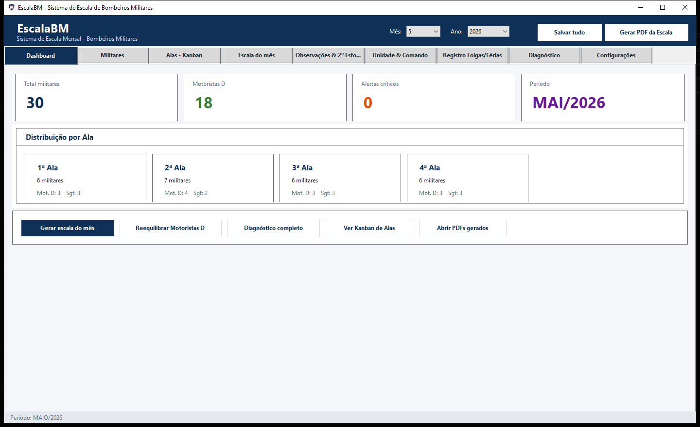
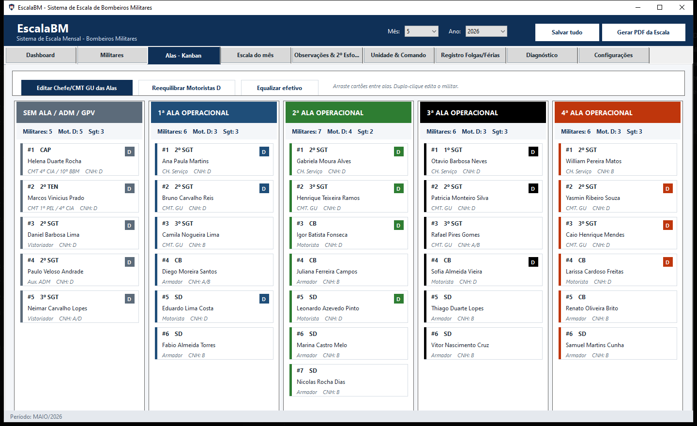
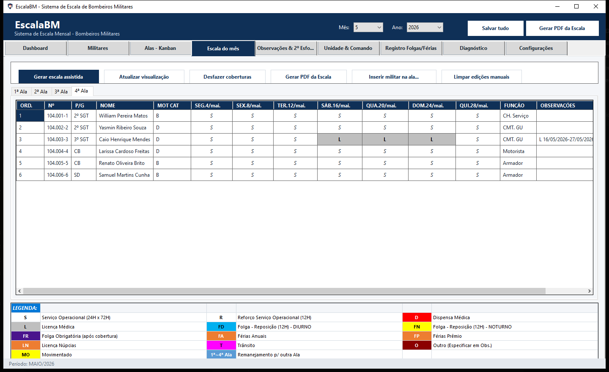
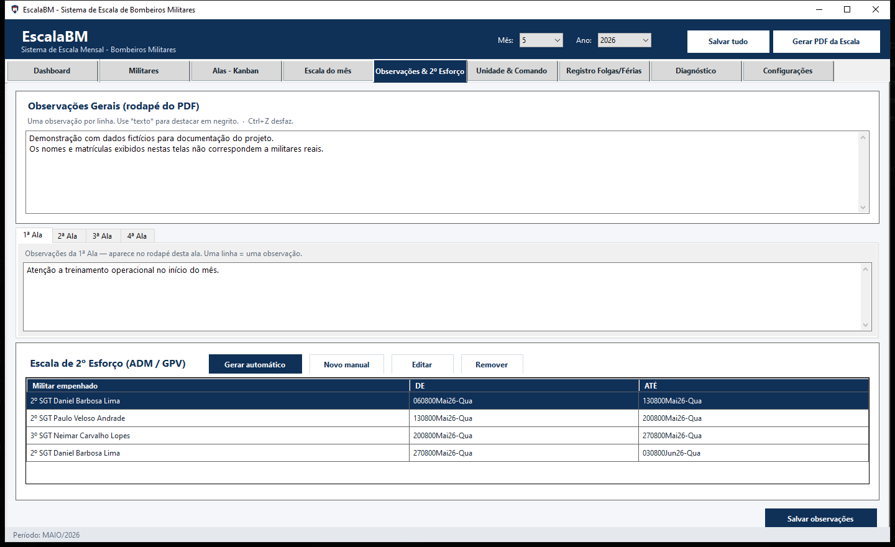

# EscalaBMC

Sistema desktop para montagem, controle e exportacao de escala mensal de Bombeiros Militares.

O projeto e uma aplicacao Windows Forms em C#/.NET 8. O PDF e gerado pelo proprio app (C#/QuestPDF), usando exatamente a mesma logica da tela. A pasta publicada e self-contained: funciona em qualquer computador Windows sem instalar nada (nem .NET, nem Python).

## Funcionalidades

- Cadastro de militares, secoes, funcoes, CNH, alas e antiguidade.
- Kanban de alas com movimentacao visual.
- Geracao e visualizacao da escala mensal.
- Lancamento de ausencias, ferias, folgas, transito, licencas e remanejamentos.
- Cobertura automatica de ausencias entre alas adjacentes.
- Escala automatica de 2º esforco para ADM/GPV.
- Observacoes gerais e por ala persistentes entre meses.
- Exportacao de PDF no layout operacional da unidade (motor C#/QuestPDF, identico a tela).
- Build portavel self-contained (nao requer .NET nem Python no destino).

## Capturas de tela

As imagens abaixo usam dados ficticios apenas para demonstracao.

### Dashboard



### Kanban de alas



### Escala do mes



### Observacoes e 2o esforco



## Privacidade dos dados

Os arquivos de dados reais ficam em `data/` e os PDFs gerados em `output/`. Essas pastas estao ignoradas pelo Git para evitar publicar nomes, matriculas, ferias, afastamentos e escalas reais.

Ao levar o sistema para outro computador, copie a pasta publicada inteira:

```text
dist/EscalaBMC
```

Nessa pasta ficam o executavel, os dados e os PDFs gerados.

## Requisitos para desenvolvimento

- Windows 10 ou superior.
- .NET SDK 8.

> O exportador PDF agora e 100% C# (QuestPDF). Nao e mais necessario Python.
> As pastas `python_pdf/` e `pdf_exporter/` ficaram obsoletas e podem ser removidas.

## Executar em modo desenvolvimento

```bat
iniciar.bat
```

Ou diretamente:

```bat
dotnet run --project EscalaBMC.csproj
```

## Gerar build final

```bat
build.bat
```

A build final sera publicada em:

```text
dist/EscalaBMC/EscalaBMC.exe
```

O script preserva os dados (`data/`) e os PDFs (`output/`) ja existentes na pasta publicada.

## Gerar PDF via linha de comando

```bat
dist\EscalaBMC\EscalaBMC.exe --export-pdf 6 2026
```

O arquivo sera criado em:

```text
dist/EscalaBMC/output
```

## Recalcular coberturas via linha de comando

```bat
dist\EscalaBMC\EscalaBMC.exe --recalc-coverages 6 2026
```

## Estrutura principal

- `MainForm.cs`: interface principal WinForms.
- `Dialogs.cs`: janelas auxiliares de cadastro, ausencias, alas e 2º esforco.
- `EscalaLogic.cs`: regras de escala, diagnostico, remanejamentos e coberturas.
- `Models.cs`: modelos de dados serializados em JSON.
- `Storage.cs`: persistencia local em `data/` e `output/`.
- `PdfExport.cs`: gerador de PDF em C#/QuestPDF (motor unico, igual a tela).
- `python_pdf/`, `pdf_exporter/`: gerador PDF antigo em Python (OBSOLETO, nao usado).
- `assets/`: icone e logo usados pelo app/PDF.
